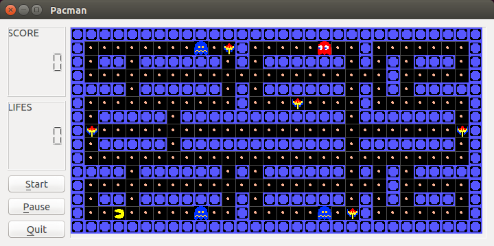

# Pacman

This implementation of the game Pacman was developed for the course `Object Oriented Programming in C++` in Politechnika Łódzka.

## Building the game

The project uses QT 4 to render graphics. The easiest way to compile the project is to:

- Boot a Ubuntu 14 virtual machine
- Install `qt4-dev-tools` package
- `make clean` to delete previous artifacts
- `make` to compile the project
- `./testingQT` to run the game
